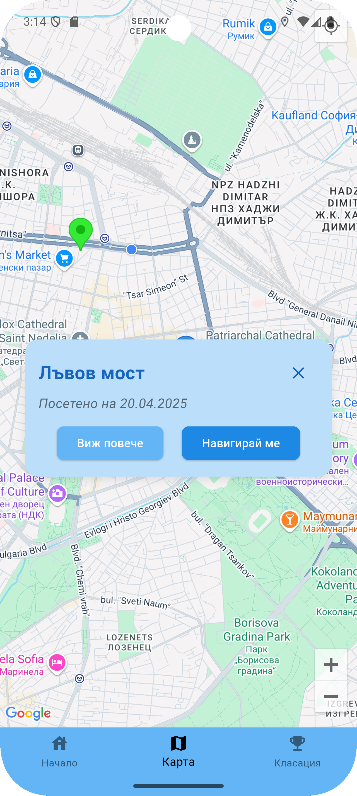
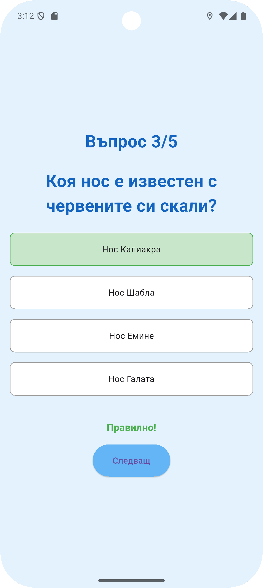
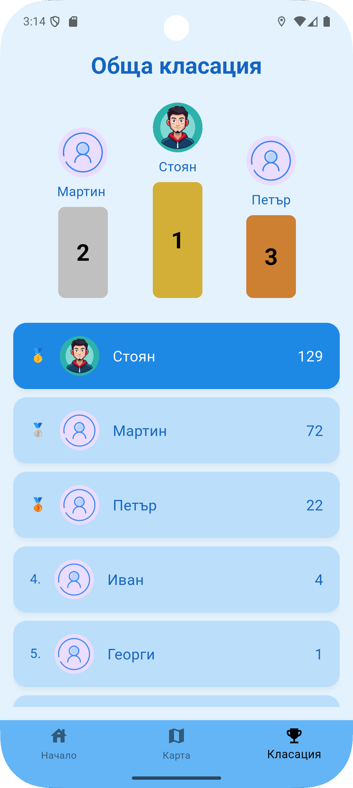

# Опознай България

Добре дошли в **Опознай България** — мобилно приложение, създадено с Flutter и Supabase, което насърчава потребителите да опознават родината си чрез викторини и посещения на културни и исторически забележителности!

---

## 🧭 Основни функционалности

- 📍 **Локация-базирани забележителности** — виж обекти в близост до теб.
- 🧠 **Дневна викторина** — тествай знанията си всеки ден и събирай streak.
- 🏛 **Специални викторини на място** — отключват се само ако си под 500м от забележителност.
- 🏆 **Класация и рангове** — състезавай се с други и печели точки.
- 🧑‍💼 **Администраторски панел** — добавяй и премахвай обекти и въпроси.
- 🌐 **Двуезичен интерфейс** — български и английски език.
- 🌙 **Светла и тъмна тема**.

---

## 🖼️ Визия

### 🏠 Начален екран на потребителя


### 🏛 Забележителности в района


### 📍 Карта с обекти


### 🧠 Дневна викторина


### 🏆 Класация


---

## 🏗️ Технологии

- **Flutter** – за мобилното приложение
- **Supabase** – като бекенд: база данни, authentication, функции и тригери
- **cron-job.org** – за автоматично рестартиране на дневната викторина в полунощ
- **Google OAuth** – вход с Google акаунт
- - **Google Maps** – интеграция на Google maps за обектите и навигация

---

## ⚙️ Архитектура

Приложението „Опознай България“ е изградено с помощта на Flutter – мултиплатформена рамка, която позволява създаването на едно общо приложение за Android и iOS. Flutter осигурява гладък и модерен потребителски интерфейс, като използва богат набор от готови компоненти и лесно персонализиращи се елементи, които са в основата на динамичния и интерактивен UX на приложението.
За съхранение и управление на данните се използва Supabase – модерен, open-source backend, който предлага функционалност, подобна на Firebase, но с изцяло SQL-базирана основа. Supabase осигурява следните ключови компоненти в архитектурата:
Аутентикация – за вход и регистрация на потребителите, включително OAuth интеграция с Google акаунти;
Релационна база данни (PostgreSQL) – за съхранение на информация като потребителски профили, забележителности, резултати от викторини, въпроси и класации;
Realtime API – за синхронизация на данни между клиента и сървъра;
Storage – при нужда за съхранение на изображения или файлове, асоциирани със забележителностите.


---

## Contributors

- [Hristo Sotirov](https://github.com/HristoSotirov)
- [Stoyan Ivanov](https://github.com/stiv03)

## 🛠️ Инсталация и стартиране

1. **Клонирай репото**
   ```bash
   git clone https://github.com/HristoSotirov/discover_bulgaria
   cd discover_bulgaria
